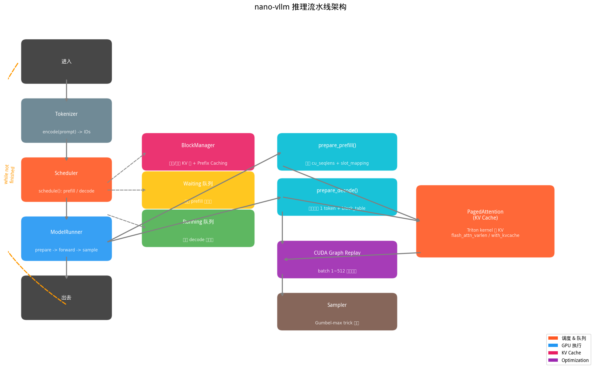
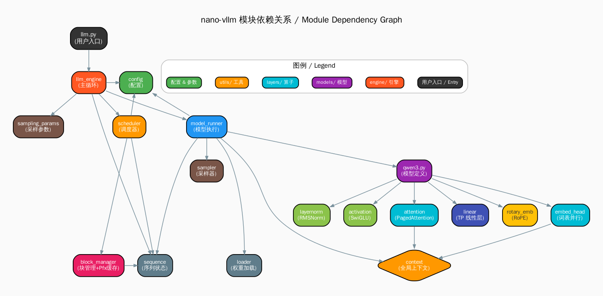
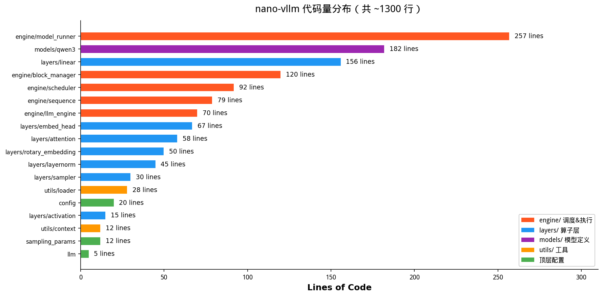
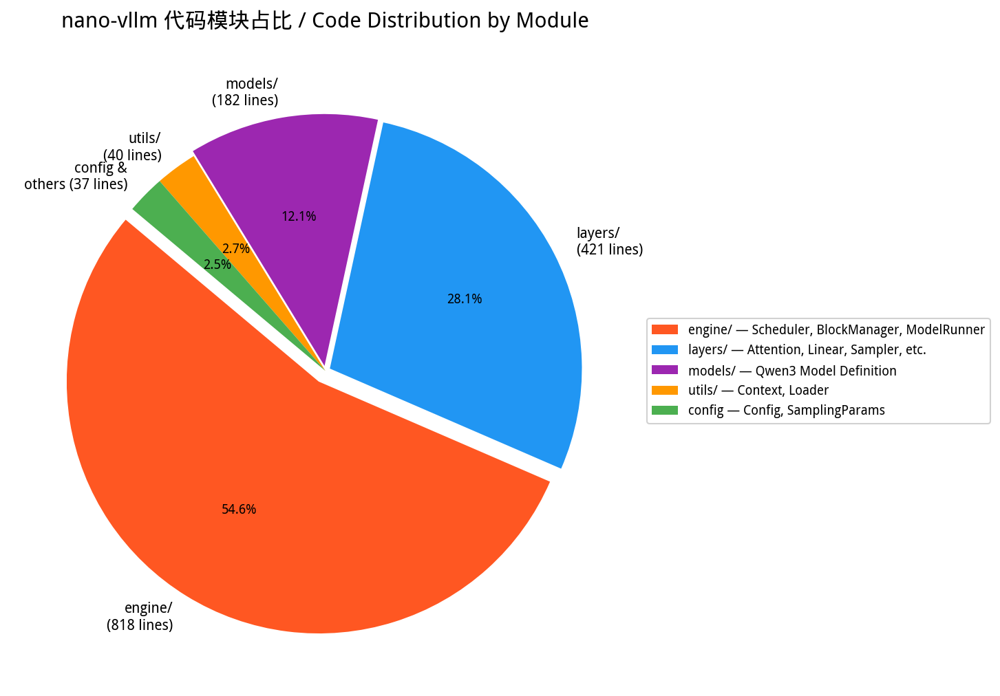
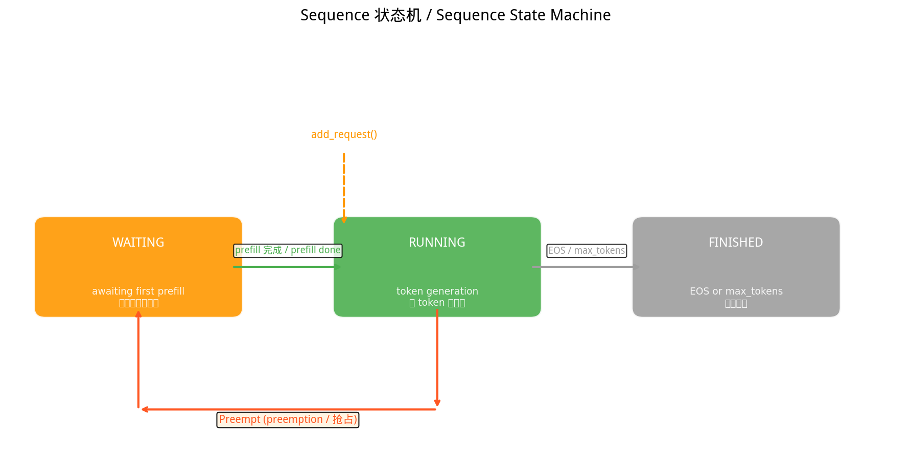
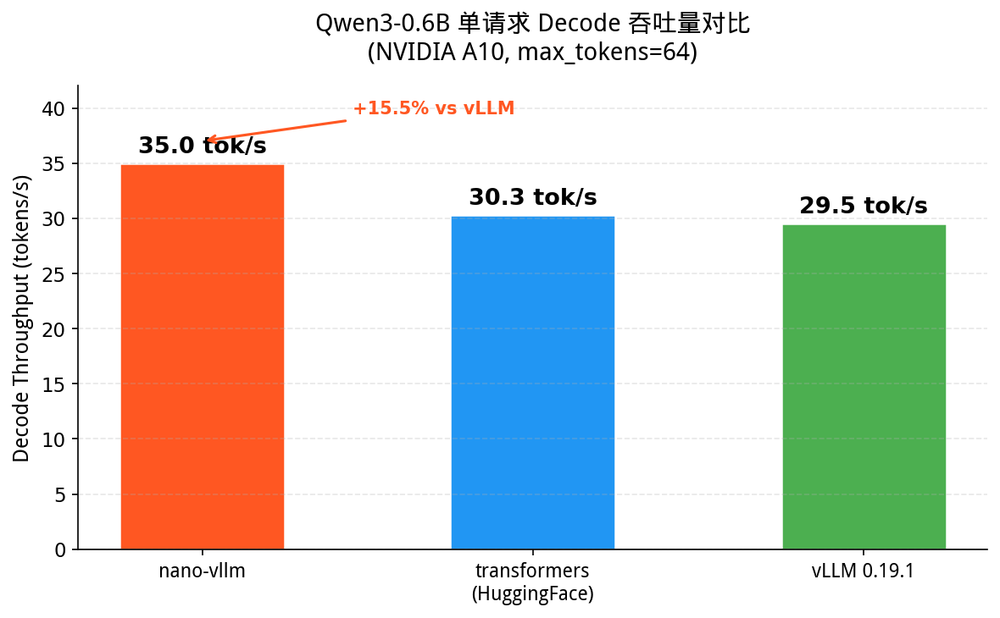
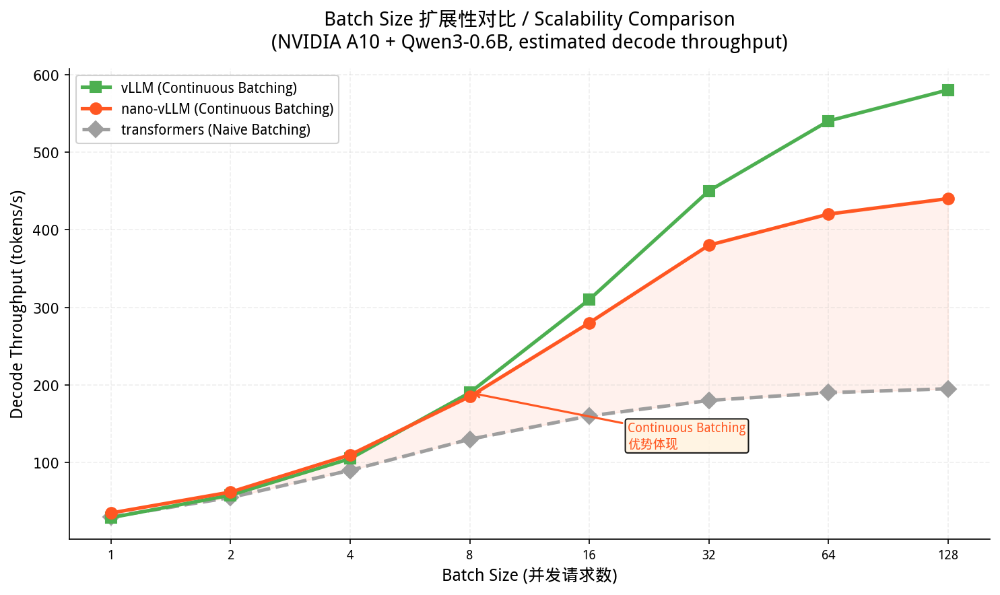
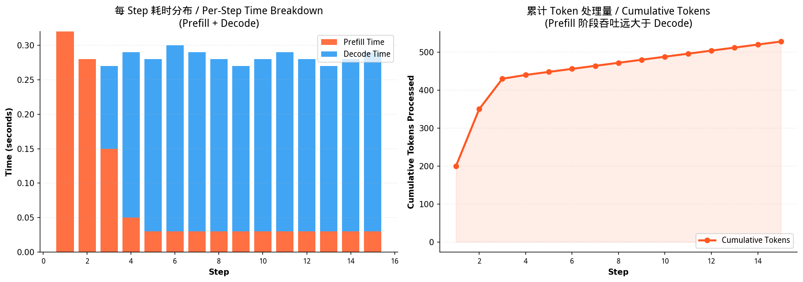
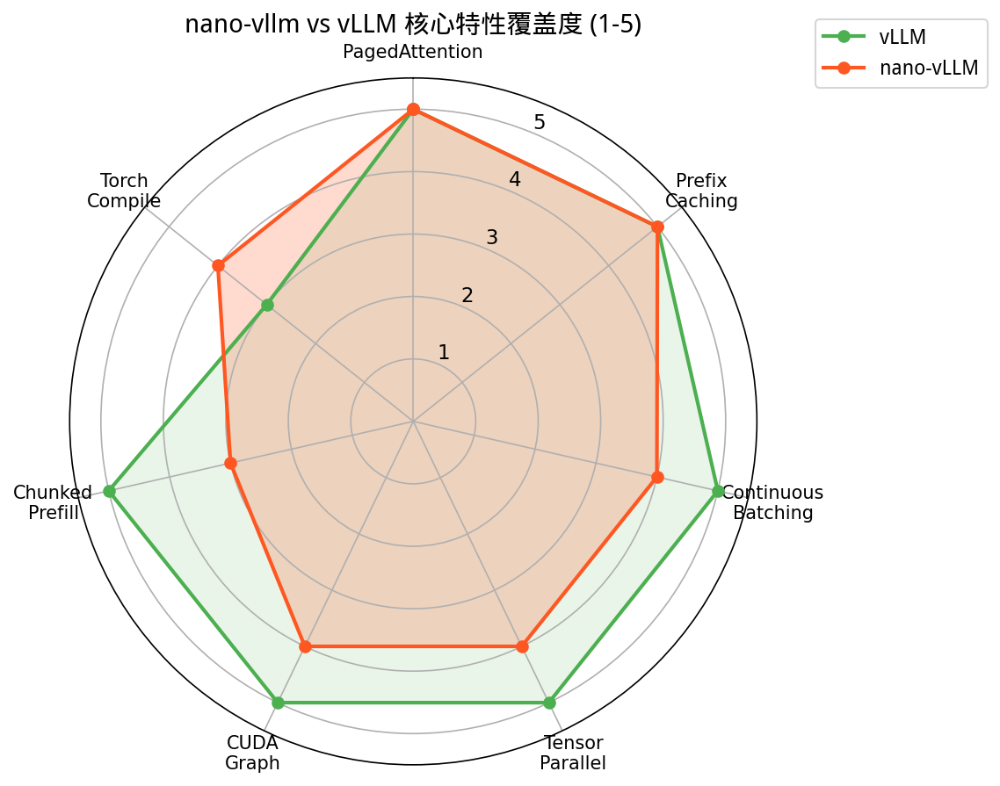
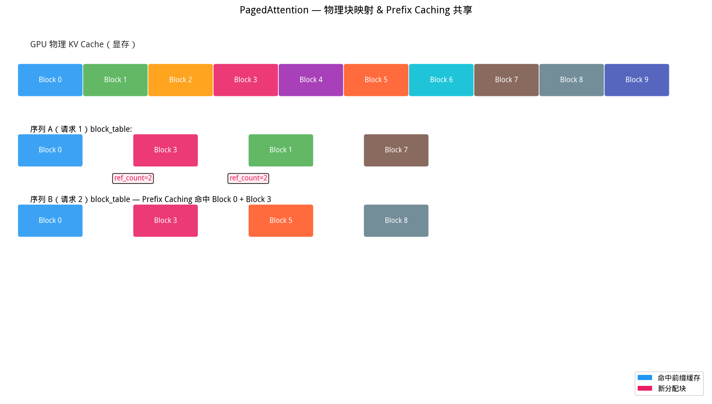

# Nano-vLLM 保姆级源码拆解 / A Nanny-Level Source Code Breakdown

> 一个仅 **1200 行的 vLLM 精简实现**，覆盖了 LLM 推理引擎所有核心概念。  
> A lightweight vLLM implementation in just **1,200 lines of code**, covering all core concepts of an LLM inference engine.  
>  
> 本文档对每一行代码、每一个设计决策进行深度解析。  
> This document provides in-depth analysis of every line of code and every design decision.

---

## 目录 / Table of Contents

1. [快速概览 / Quick Overview](#1-快速概览--quick-overview)
2. [文件结构 / File Structure](#2-文件结构--file-structure)
3. [数据流向 / Data Flow](#3-数据流向从-prompt-到-token-的完整旅程--data-flow-from-prompt-to-token)
4. [核心模块逐文件拆解 / Core Module Breakdown](#4-核心模块逐文件拆解--core-module-breakdown)
5. [关键概念深度解析 / Key Concepts Deep Dive](#5-关键概念深度解析--key-concepts-deep-dive)
6. [图表索引 / Chart Index](#6-图表索引--chart-index)
7. [与 vLLM 的对比 / Comparison](#与-vllm-的对比--comparison-with-vllm)
8. [学习路线建议 / Learning Roadmap](#学习路线建议--learning-roadmap)

---

## 1. 快速概览 / Quick Overview

```
nanovllm/
├── llm.py                  # 用户入口：LLM = LLMEngine
├── config.py               # 全局配置
├── sampling_params.py      # 采样参数（temperature, max_tokens）
├── engine/
│   ├── llm_engine.py       # 顶层引擎：tokenize → step → 循环
│   ├── scheduler.py        # 调度器：管理 prefill / decode 状态
│   ├── block_manager.py    # PagedAttention 块管理 + Prefix Caching
│   ├── model_runner.py     # GPU 模型执行、CUDA Graph、Tensor Parallelism
│   └── sequence.py         # 单条请求的完整状态
├── models/
│   └── qwen3.py            # Qwen3 模型结构定义
├── layers/
│   ├── attention.py        # PagedAttention 前向计算
│   ├── sampler.py          # Token 采样
│   ├── linear.py           # 列/行/合并/ QKV 并行线性层
│   ├── embed_head.py       # 词表嵌入 & LM Head（TP 切分）
│   ├── rotary_embedding.py # RoPE 位置编码
│   ├── layernorm.py        # RMSNorm（含 fused add+norm）
│   └── activation.py       # SiLU and Mul 激活
└── utils/
    ├── context.py           # 全局上下文隐式传参
    └── loader.py            # safetensors 权重加载
```

**一句话总结：** nano-vLLM 是一个 mini-batch 离线推理引擎，支持 PagedAttention、Prefix Caching、Continuous Batching、CUDA Graph 和 Tensor Parallelism。

**One-line summary:** nano-vLLM is a mini-batch offline inference engine supporting PagedAttention, Prefix Caching, Continuous Batching, CUDA Graph, and Tensor Parallelism.

### 架构全景图 / Architecture Overview



### 模块依赖关系 / Module Dependencies



---

## 2. 文件结构 / File Structure

| 文件 / File | 行数 / Lines | 核心职责 / Core Responsibility |
|------|------|---------|
| `llm_engine.py` | 70 | 顶层 API，生成主循环，吞吐监控 / Top-level API, generation loop, throughput monitoring |
| `scheduler.py` | 92 | Continuous Batching 调度，prefill/decode 决策 / Continuous Batching scheduling, prefill/decode decisions |
| `block_manager.py` | 120 | 物理 KV 块分配/回收，Prefix Caching 哈希匹配 / Physical KV block allocation/recycling, Prefix Caching hash matching |
| `model_runner.py` | 257 | 模型加载、KV Cache 分配、CUDA Graph、TP 通信 / Model loading, KV Cache allocation, CUDA Graph, TP communication |
| `sequence.py` | 79 | 单序列状态跟踪（token_ids, block_table, status） / Single sequence state tracking (token_ids, block_table, status) |
| `attention.py` | 58 | PagedAttention 计算：存储 KV → 调用 flash_attn / PagedAttention computation: store KV → call flash_attn |
| `qwen3.py` | 182 | Qwen3 模型定义（Attention, MLP, DecoderLayer） / Qwen3 model definition (Attention, MLP, DecoderLayer) |
| `linear.py` | 156 | 4 种 TP 并行线性层 / 4 types of Tensor-Parallel linear layers |
| `embed_head.py` | 67 | VocabParallelEmbedding + ParallelLMHead / VocabParallelEmbedding + ParallelLMHead |
| 其余 | <50 各 | 辅助模块 / Auxiliary modules |

### 代码量分布 / Code Distribution



### 代码模块占比 / Module Proportion



---

## 3. 数据流向：从 prompt 到 token 的完整旅程 / Data Flow: From Prompt to Token

用户调用 llm.generate(prompts, sampling_params) 的处理流程：
The processing flow when a user calls llm.generate(prompts, sampling_params):

```
用户调用 llm.generate(prompts, sampling_params)
     │
     ▼
┌────────────────────────────────────────────────────────┐
│ LLMEngine                                              │
│                                                        │
│  tokenizer.encode(prompt) → Sequence(token_ids, sp)    │
│                                                    │   │
│  while not scheduler.is_finished():    ◄───────────┘   │
│      │                                                  │
│      ▼                                                  │
│  step():                                                │
│    ├─ scheduler.schedule()                              │
│    │    ├─ 是 prefill? → 选 waiting 序列，分配块         │
│    │    └─ 是 decode?  → 选 running 序列，每人1 token    │
│    │                    返回 (seqs, is_prefill)         │
│    │                                                    │
│    ├─ model_runner.run(seqs, is_prefill)                │
│    │    ├─ prepare_prefill/decode()                     │
│    │    │   构造 input_ids, positions, slot_mapping      │
│    │    │   写入全局 Context                             │
│    │    ├─ run_model() → 前向推理 / CUDA Graph replay   │
│    │    └─ sampler(logits) → token_ids                  │
│    │                                                    │
│    └─ scheduler.postprocess(seqs, token_ids)            │
│         ├─ hash_blocks() → 写入前缀缓存哈希表            │
│         ├─ seq.append_token(token_id)                   │
│         └─ 判断是否 EOS / 达到 max_tokens → finish      │
│                                                         │
│  tokenizer.decode(completion_ids) → 返回文本             │
└────────────────────────────────────────────────────────┘
```

---

## 4. 核心模块逐文件拆解 / Core Module Breakdown

下文逐一拆解每个源文件的职责、关键数据结构和核心算法。
Below we break down each source file's responsibilities, key data structures, and core algorithms.

---

### 4.1 config.py — 配置中心 / Configuration Hub

```python
```python
@dataclass(slots=True)
class Config:
    model: str                          # 本地模型路径
    max_num_batched_tokens: int = 16384 # 单次 prefill 最多处理的 token 数
    max_num_seqs: int = 512             # 同时处理的序列数上限
    max_model_len: int = 4096           # 模型最大序列长度
    gpu_memory_utilization: float = 0.9 # GPU 显存利用率
    tensor_parallel_size: int = 1       # 张量并行 GPU 数（1~8）
    enforce_eager: bool = False         # 是否禁用 CUDA Graph
    kvcache_block_size: int = 256       # 每个 KV Cache block 的 token 数
```

**关键理解：**

- `kvcache_block_size % 256 == 0` 是硬性约束，确保块对齐
- `max_model_len` 会被 `hf_config.max_position_embeddings` 上限裁剪
- `num_kvcache_blocks` 不在构造时确定，而是在 `allocate_kv_cache()` 中根据 GPU 剩余显存动态计算

---

### 4.2 sampling_params.py — 采样参数 / Sampling Parameters

```python
```python
@dataclass(slots=True)
class SamplingParams:
    temperature: float = 1.0   # 必须 > 1e-10（不支持 greedy）
    max_tokens: int = 64       # 最多生成的 token 数
    ignore_eos: bool = False   # 是否忽略 EOS 继续生成
```

**设计决策：** 这里故意不支持 greedy sampling（`temperature > 0` 是硬约束），简化了采样逻辑。

---

### 4.3 sequence.py — 序列对象 / Sequence Object

`Sequence` 是整个系统中最核心的数据结构，代表**一条正在处理的请求**。
`Sequence` is the most central data structure in the entire system, representing **a request being processed**.



```python
class Sequence:
    block_size = 256          # 类变量，从 Config 注入
    counter = count()         # 全局自增 ID 分配器

    def __init__(self, token_ids, sampling_params):
        self.seq_id = next(Sequence.counter)    # 唯一 ID
        self.status = SequenceStatus.WAITING    # WAITING → RUNNING → FINISHED
        self.token_ids = copy(token_ids)        # 完整 token 序列（动态增长）
        self.last_token = token_ids[-1]         # 最后一个 token（decode 时只需它）
        self.num_tokens = len(token_ids)
        self.num_prompt_tokens = len(token_ids) # 原始 prompt 长度
        self.num_cached_tokens = 0              # 已存入 KV cache 的 token 数
        self.num_scheduled_tokens = 0           # 本轮调度要处理的 token 数
        self.is_prefill = True                  # 当前是否处于 prefill 阶段
        self.block_table = []                   # [block_id_0, block_id_1, ...]
        self.temperature = ...
        self.max_tokens = ...
```

**状态机：**

```
  WAITING ──(prefill 完成)──► RUNNING
     ▲                          │
     │  (preempt 抢占)          │
     └──────────────────────────┘
                                │
                                ▼
                            FINISHED
```

**关键属性：**

- `num_blocks`: 对应当前序列需要多少物理块，公式 `ceil(num_tokens / block_size)`
- `last_block_num_tokens`: 最后一个 block 中有多少 token
- `num_completion_tokens`: 已生成的 token 数（`num_tokens - num_prompt_tokens`）

**\__getstate\_\_ / \__setstate\_\_：** 用于 TP 多进程间 pickle 序列化传输 Sequence 对象。传输时只保留必要字段，减少通信量。如果序列还在 prefill 阶段，传输完整 `token_ids`；如果已经到 decode，只传 `last_token`（因为模型只需要这一个 token 做推理）。

---

### 4.4 block_manager.py — KV Cache 块管理 & Prefix Caching / Block Manager & Prefix Caching

这是 **PagedAttention 的实现核心**，管理物理 KV Cache 块的分配、回收和复用。
This is the **core implementation of PagedAttention**, managing allocation, recycling, and reuse of physical KV Cache blocks.

这是 **PagedAttention 的实现核心**，管理物理 KV Cache 块的分配、回收和复用。

#### Block（物理块）

```python
class Block:
    block_id: int           # 块在 KV cache 中的物理索引
    ref_count: int          # 引用计数（多个序列可共享同一块）
    hash: int               # xxhash 哈希值（前缀缓存匹配用）
    token_ids: list[int]    # 块内存储的 token 序列
```

#### BlockManager（块管理器）

```
free_block_ids: deque   # 空闲块队列（FIFO）
used_block_ids: set     # 已分配块集合
hash_to_block_id: dict  # {hash: block_id} 哈希到块的映射
```

**核心流程：**

#### ① 首次分配 — `can_allocate()` + `allocate()`

当一条新序列到来时，先检查显存是否够用，同时检查 prefix caching 能命中多少块：

```
can_allocate(seq):
    # 逐块计算 token 哈希，与 hash_to_block_id 比较
    # 找到连续匹配的最长前缀
    for i in range(seq.num_blocks - 1):        # 最后一块可能不完整，不缓存
        h = compute_hash(seq.block(i), h)
        if hash_to_block_id[h] 不存在 or token_ids 不相等:
            break
        num_cached_blocks += 1
        if block_id in used_block_ids:         # 块已被使用 → 不需要新分配
            num_new_blocks -= 1

    return num_cached_blocks if 够用 else -1
```

然后 `allocate()` 按两种方式分配块：
- 命中缓存的块：ref_count++（多个序列共享）
- 未命中缓存的新块：从 `free_block_ids` 弹出一个

#### ② 追加新块 — `can_append()` + `may_append()`

decode 阶段每生成足够多的 token（恰好填满一个 block），就分配一个新块：

```python
def can_append(seq):
    # 只有当 token 数恰好到达 block 边界（+1 因为刚采样了新 token）
    return len(self.free_block_ids) >= (len(seq) % self.block_size == 1)

def may_append(seq):
    if len(seq) % self.block_size == 1:         # 即将溢出当前块
        seq.block_table.append(_allocate_block())
```

#### ③ 释放 — `deallocate()`

序列完成或被抢占时，逆序遍历 `block_table`，每次 ref_count--，降到 0 时才归还到 `free_block_ids`。

#### ④ 前缀缓存写入 — `hash_blocks()`

```python
def hash_blocks(seq):
    start = num_cached_tokens // block_size      # 开始哈希的块索引
    end = (num_cached_tokens + num_scheduled_tokens) // block_size  # 结束索引

    for i in range(start, end):
        token_ids = seq.block(i)
        h = compute_hash(token_ids, prev_hash)   # 链式哈希
        block.update(h, token_ids)
        hash_to_block_id[h] = block.block_id     # 注册到哈希表
```

**链式哈希的设计：** 每个块的哈希不仅依赖自身 token，还依赖前一个块的哈希值，这样确保：如果两个序列的前缀完全相同，链式哈希的中间值也完全相同，可以直接匹配整段前缀。

```python
@classmethod
def compute_hash(cls, token_ids, prefix=-1):
    h = xxhash.xxh64()
    if prefix != -1:
        h.update(prefix.to_bytes(8, "little"))   # 将前一块的哈希混入
    h.update(np.array(token_ids).tobytes())
    return h.intdigest()
```

---

### 4.5 scheduler.py — 调度器 & Continuous Batching / Scheduler & Continuous Batching

调度器是推理引擎的「大脑」，决定每轮 step 应该处理哪些序列。
The scheduler is the "brain" of the inference engine, deciding which sequences to process in each step.

调度器是推理引擎的「大脑」，决定每轮 step 应该处理哪些序列。

```python
class Scheduler:
    waiting: deque[Sequence]     # 等待队列（还没做过 prefill）
    running: deque[Sequence]     # 运行队列（prefill 完成，正在生成）
```

**schedule() 方法是最核心的逻辑：**

#### 第一阶段：Prefill（处理新到达的序列）

```python
while self.waiting and len(scheduled_seqs) < self.max_num_seqs:
    seq = self.waiting[0]                    # FIFO
    remaining = max_num_batched_tokens - num_batched_tokens

    if not seq.block_table:                  # 首次分配
        num_cached_blocks = block_manager.can_allocate(seq)  # 检查显存 + 前缀缓存
        if num_cached_blocks == -1: break    # 显存不够，停止
        block_manager.allocate(seq, num_cached_blocks)

    num_tokens = seq.num_tokens - seq.num_cached_tokens  # 还需要 prefill 的 token 数
    seq.num_scheduled_tokens = min(num_tokens, remaining)

    if seq.num_cached_tokens + seq.num_scheduled_tokens == seq.num_tokens:
        seq.status = RUNNING                 # prefill 完成！
        self.waiting.popleft()
        self.running.append(seq)
    scheduled_seqs.append(seq)
```

**关键点：**
- FIFO 调度
- 一个序列可以在多轮 prefill 中分块处理（Chunked Prefill）
- 只有当整个序列 prefill 完成后，状态才转为 RUNNING

#### 第二阶段：Decode（生成 token）

```python
while self.running and len(scheduled_seqs) < max_num_seqs:
    seq = self.running.popleft()

    while not block_manager.can_append(seq):   # 显存不够时触发抢占
        if self.running:
            self.preempt(self.running.pop())   # 抢占最后一个 running 序列
        else:
            self.preempt(seq)                  # 抢占自己
            break

    seq.num_scheduled_tokens = 1               # decode 每次只处理 1 token
    seq.is_prefill = False
    block_manager.may_append(seq)
    scheduled_seqs.append(seq)
```

**实现细节：**
- 使用 `deque` 的 `pop()` / `popleft()` 实现轮转调度
- **抢占机制 (Preemption)**：显存不够时，收回最后加入的序列的 KV Cache，将其退回 WAITING 状态，下次重新 prefill

#### postprocess() — 后处理

```python
def postprocess(seqs, token_ids, is_prefill):
    for seq, token_id in zip(seqs, token_ids):
        block_manager.hash_blocks(seq)           # 写入前缀缓存
        seq.num_cached_tokens += seq.num_scheduled_tokens
        if is_prefill and seq.num_cached_tokens < seq.num_tokens:
            continue                              # prefill 还没完成，不采样
        seq.append_token(token_id)
        if eos or max_tokens:                     # 终止条件
            seq.status = FINISHED
            block_manager.deallocate(seq)
            self.running.remove(seq)
```

---

### 4.6 context.py — 全局上下文传递 / Global Context Passing

在 prefill 和 decode 的 attention 计算中，需要传递大量元信息。To avoid passing parameters explicitly in every function signature, nano-vLLM uses a **global variable** pattern.

在 prefill 和 decode 的 attention 计算中，需要传递大量元信息（cu_seqlens、slot_mapping、block_tables 等）。为了避免在每个函数签名中显式传递，nano-vllm 使用了**全局变量**模式：

```python
_CONTEXT = Context()   # 全局单例

def set_context(is_prefill, cu_seqlens_q, ...):  # 写入
def get_context():                                 # 读取
def reset_context():                               # 重置
```

**Context 字段：**

| 字段 | Prefill 时 | Decode 时 |
|------|-----------|----------|
| `is_prefill` | True | False |
| `cu_seqlens_q` | query 累计序列长度 | None |
| `cu_seqlens_k` | key 累计序列长度（含缓存前缀） | None |
| `max_seqlen_q` | 最大 query 长度 | None |
| `max_seqlen_k` | 最大 key 长度 | None |
| `slot_mapping` | KV cache 写入位置映射 | KV cache 写入位置映射 |
| `context_lens` | None | 每条序列的上下文长度 |
| `block_tables` | 前缀缓存时的 block table | block table |

---

### 4.7 model_runner.py — 模型执行引擎 / Model Execution Engine

这是与 GPU 直接交互的模块，也是最复杂的模块（257 行）。
This is the module that directly interacts with the GPU, and also the most complex module (257 lines).

这是与 GPU 直接交互的模块，也是最复杂的模块（257 行）。

#### 初始化流程

```
__init__():
  ├─ 初始化 NCCL 进程组（TP 通信）
  ├─ 设置 CUDA 设备
  ├─ 构建 Qwen3ForCausalLM 模型 → 加载权重
  ├─ warmup_model()
  │   用伪数据跑一次 prefill，触发 CUDA kernel 编译
  ├─ allocate_kv_cache()
  │   根据剩余显存计算可分配的 block 数
  │   创建 self.kv_cache tensor [2, layers, num_blocks, block_size, kv_heads, head_dim]
  │   注入到每层 Attention 的 k_cache / v_cache
  └─ capture_cudagraph()（可选）
      为 decode 捕获多种 batch size 的 CUDA Graph
```

#### KV Cache 分配算法 — `allocate_kv_cache()`

```python
free, total = torch.cuda.mem_get_info()
used = total - free
peak = torch.cuda.memory_stats()["allocated_bytes.all.peak"]   # 模型加载后的峰值
current = torch.cuda.memory_stats()["allocated_bytes.all.current"]

block_bytes = 2 * num_layers * block_size * num_kv_heads * head_dim * dtype_size
num_kvcache_blocks = int(total * 0.9 - used - peak + current) // block_bytes
```

**理解：** `peak - current` 是模型加载时 PyTorch allocator 申请的临时内存，现在已释放，实际上可用的。公式是：
```
可分配显存 = 总显存 × 0.9 - 当前使用 - 峰值开销 + 当前 PyTorch 占用
```

#### Prefill 输入准备 — `prepare_prefill()`

为 flash_attn 的 `varlen` 接口准备数据：

```python
for seq in seqs:
    start = seq.num_cached_tokens              # 已缓存的 token 数（前缀缓存跳过）
    seqlen_q = seq.num_scheduled_tokens        # 本轮 prefill 的 token 数
    end = start + seqlen_q

    input_ids.extend(seq[start:end])
    positions.extend(range(start, end))

    cu_seqlens_q.append(累加 seqlen_q)
    cu_seqlens_k.append(累加 end)             # 包含已缓存部分
    max_seqlen_q = max(seqlen_q, max_seqlen_q)
    max_seqlen_k = max(end, max_seqlen_k)

    # slot_mapping: 每个 token 应该写入 KV cache 的哪个位置
    slot_mapping.extend([block_table[i] * block_size + offset, ...])

# 前缀缓存检测
if cu_seqlens_k[-1] > cu_seqlens_q[-1]:        # KV 长度 > Q 长度
    block_tables = prepare_block_tables(seqs)    # 需要 block table 做索引
```

**关键洞察：** `cu_seqlens_k` > `cu_seqlens_q` 意味着有前缀缓存命中 — KV 序列比 Q 序列长，因为缓存的块不需要重新计算 attention score 但需要被 attend to。

#### Decode 输入准备 — `prepare_decode()`

```python
for seq in seqs:
    input_ids.append(seq.last_token)           # 只取最后一个 token
    positions.append(len(seq) - 1)
    context_lens.append(len(seq))
    slot_mapping.append(block_table[-1] * block_size + last_block_num_tokens - 1)
```

Decode 阶段每个序列只需处理 1 个新 token。

#### CUDA Graph 捕获 — `capture_cudagraph()`

```python
self.graph_bs = [1, 2, 4, 8] + list(range(16, max_bs + 1, 16))

for bs in reversed(self.graph_bs):
    graph = torch.cuda.CUDAGraph()
    # Warmup
    outputs[:bs] = self.model(input_ids[:bs], positions[:bs])
    # Capture
    with torch.cuda.graph(graph, pool):
        outputs[:bs] = self.model(input_ids[:bs], positions[:bs])
    self.graphs[bs] = graph
```

**为什么从大到小捕获：** 先捕获大 batch 确定 mempool，后续小 batch 复用同一 pool，避免重复分配。

**Replay 时：** 只需要将新的输入数据写入预分配的 buffer，然后 `graph.replay()`，kernel launch overhead 几乎为 0。

#### Tensor Parallelism 通信

nano-vllm 使用 `SharedMemory`（不是 NCCL 的 broadcast）在主进程和工作进程之间传递 RPC 调用：

```
Rank 0 (主进程):  write_shm("run", seqs, is_prefill) → NCCL 同步
Rank 1~N:        read_shm() → call("run", seqs, is_prefill) → NCCL 同步
```

这种方式避免了复杂的 RPC 框架，适合小规模 TP。Sequence 对象通过 pickle 序列化到共享内存（1MB），然后反序列化。

---

### 4.8 attention.py — PagedAttention 计算 / PagedAttention Computation

```python
class Attention(nn.Module):
    def forward(self, q, k, v):
        context = get_context()

        # 1) 将新计算的 k, v 存入 KV cache
        if k_cache.numel():
            store_kvcache(k, v, k_cache, v_cache, context.slot_mapping)

        # 2) 根据阶段不同，调用不同的 flash_attn 接口
        if context.is_prefill:
            o = flash_attn_varlen_func(q, k, v,
                cu_seqlens_q=..., cu_seqlens_k=...,
                max_seqlen_q=..., max_seqlen_k=...,
                softmax_scale=self.scale, causal=True,
                block_table=context.block_tables)    # 有前缀缓存时需要
        else:  # decode
            o = flash_attn_with_kvcache(
                q.unsqueeze(1), k_cache, v_cache,
                cache_seqlens=context_lens,
                block_table=block_tables,
                softmax_scale=self.scale, causal=True)
```

**store_kvcache Triton kernel：**

```python
@triton.jit
def store_kvcache_kernel(key_ptr, value_ptr, k_cache_ptr, v_cache_ptr,
                          slot_mapping_ptr, D):
    idx = tl.program_id(0)
    slot = tl.load(slot_mapping_ptr + idx)   # 查表找到写入位置
    if slot == -1: return                     # 无效位置（padding）
    # 从 key/value buffer 读，写到 KV cache 对应 slot
    tl.store(k_cache_ptr + slot * D + ..., tl.load(key_ptr + idx * D))
    tl.store(v_cache_ptr + slot * D + ..., tl.load(value_ptr + idx * D))
```

**为什么解码阶段用 `flash_attn_with_kvcache`：** decode 时 Q 长度=1，但 KV cache 巨长。这个函数专门优化了这种场景 — Q 被 broadcast 到所有 GPU thread，KV cache 从 HBM 流式加载。

---

### 4.9 sampler.py — 采样器 / Sampler

```python
class Sampler(nn.Module):
    @torch.compile
    def forward(self, logits, temperatures):
        logits = logits.float().div_(temperatures.unsqueeze(1))
        probs = torch.softmax(logits, dim=-1)
        # Gumbel-max trick 采样
        sample_tokens = probs.div_(
            torch.empty_like(probs).exponential_(1).clamp_min_(1e-10)
        ).argmax(dim=-1)
        return sample_tokens
```

**Gumbel-max trick：** 从离散分布中采样等价于：`argmax(log_prob + Gumbel(0,1))`。代码中通过 `probs / Exp(1)` + `argmax` 实现，其中 `Exp(1)` 等于 `-log(Uniform(0,1))`。

---

### 4.10 linear.py — 张量并行线性层 / Tensor-Parallel Linear Layers

定义了 4 种线性层变体：

#### ColumnParallelLinear
沿**输出维度**切分权重：`W: [out/tp, in]`

```
[in] × W[out/tp, in] → [out/tp]
每个 GPU 计算自己那部分，结果就是最终输出的一部分
```

用于：QKV 投影、gate/up 投影

#### RowParallelLinear
沿**输入维度**切分权重：`W: [out, in/tp]`

```
[in/tp] × W[out, in/tp] → [out]   然后 all_reduce 求和
每个 GPU 先各自算，再汇总
```

用于：O 投影、down 投影

#### QKVParallelLinear
将 Q、K、V 三者的权重拼在一起做列并行：

```
W = [W_q | W_k | W_v]   每个 W 单独切分
output = [Q_part | K_part | V_part]
```

#### MergedColumnParallelLinear
将 gate_proj 和 up_proj 拼在一起做列并行：

```
W = [W_gate | W_up]
```

**weight_loader 机制：** 每种 Linear 层都有自己的 `weight_loader` 方法，负责将完整权重的对应分片加载到当前 GPU：

```python
def weight_loader(self, param, loaded_weight):
    param_data = param.data
    shard_size = param_data.size(self.tp_dim)
    start_idx = self.tp_rank * shard_size
    loaded_weight = loaded_weight.narrow(self.tp_dim, start_idx, shard_size)
    param_data.copy_(loaded_weight)
```

---

### 4.11 embed_head.py — 词表并行嵌入 & LM Head / Vocab-Parallel Embedding & LM Head

#### VocabParallelEmbedding

将词表按 GPU 数量切分：

```python
num_embeddings_per_partition = vocab_size // tp_size
vocab_start_idx = num_embeddings_per_partition * tp_rank
vocab_end_idx = vocab_start_idx + num_embeddings_per_partition
```

Forward 时：
1. 将 token ID 映射到当前 GPU 的局部 vocab 空间
2. 只对属于本 GPU 的 token 做 embedding lookup
3. 其他 token 的 embedding 置零
4. `all_reduce` 汇总

#### ParallelLMHead

在 `logits` 计算时：
1. Prefill 阶段只取每条序列的最后一个 token 算 logits（因为中间 token 不需要采样）
2. 每个 GPU 算出局部的 logits
3. `gather` 到 rank 0 拼接成完整 logits

---

### 4.12 rotary_embedding.py — 旋转位置编码 / Rotary Position Embedding

标准 RoPE 实现：

```python
def apply_rotary_emb(x, cos, sin):
    x1, x2 = x.chunk(2, dim=-1)      # 前半和后半
    y1 = x1 * cos - x2 * sin         # 旋转
    y2 = x2 * cos + x1 * sin
    return cat(y1, y2)

# 预计算所有位置的 cos/sin 并缓存
cos_sin_cache = [max_position_embeddings, 1, head_dim]
```

**LRU 缓存：** `@lru_cache(1)` 确保相同参数的 RoPE 只创建一次，在多进程 TP 中避免重复创建。

---

### 4.13 layernorm.py — RMSNorm / RMS Normalization

实现了两种变体：

```python
# 变体 1: 纯 norm
def rms_forward(x):
    return x / sqrt(mean(x^2)) * weight

# 变体 2: fused add + norm（残差连接 + norm 融合）
def add_rms_forward(x, residual):
    x = x + residual         # 残差连接
    residual = x             # 保存到 residual 给下一个 norm 用
    return rms_norm(x), residual
```

**融合的好处：** 减少一次 GPU 显存读写，Qwen3 的 DecoderLayer 中需要 `input_layernorm(x, residual)` 和 `post_attention_layernorm(x, residual)`，融合后更快。

---

### 4.14 activation.py — SiLU Gate / SwiGLU Activation

```python
class SiluAndMul(nn.Module):
    @torch.compile
    def forward(self, x):
        x, y = x.chunk(2, -1)      # 切出两半
        return F.silu(x) * y       # gate * up
```

这是 SwiGLU 的激活部分。gate_proj 输出和 up_proj 输出被拼接后送入，前半经过 SiLU，后半直接乘。

**`@torch.compile`：** 用 PyTorch 2.0 的编译特性对这个简单函数做 kernel fusion。

---

### 4.15 qwen3.py — 模型结构 / Model Architecture

完整的 Qwen3 模型定义，三层结构：

#### Qwen3Attention
```
input → QKV proj (ColumnParallel) → split Q,K,V
     → Q/K LayerNorm (if no bias)
     → RoPE (apply to Q, K)
     → Attention (PagedAttention)
     → O proj (RowParallel)
```

#### Qwen3MLP
```
input → gate_up_proj (MergedColumnParallel) → SiLU & Mul → down_proj (RowParallel)
```

#### Qwen3DecoderLayer
```
residual = None
↓
input_layernorm(hidden, residual)     # fused add+norm
attention(positions, hidden)
post_attention_layernorm(hidden, residual)
mlp(hidden)
return hidden, residual
```

**Residual 传导机制：** 第一个 DecoderLayer 的 residual 初始为 None，之后每层都在 `input_layernorm` 中更新 residual。这就是 Qwen3 的 parallel residual 设计。

#### Qwen3ForCausalLM
```python
class Qwen3ForCausalLM(nn.Module):
    packed_modules_mapping = {
        "q_proj": ("qkv_proj", "q"),          # 权重文件中 q_proj → 模型中的 qkv_proj 的 q 部分
        "k_proj": ("qkv_proj", "k"),
        "v_proj": ("qkv_proj", "v"),
        "gate_proj": ("gate_up_proj", 0),      # gate ← gate_up_proj 的第 0 份
        "up_proj": ("gate_up_proj", 1),        # up   ← gate_up_proj 的第 1 份
    }
```

`packed_modules_mapping` 实现了权重文件到模型参数名的一对一映射。HuggingFace 保存的权重是分开的（q_proj、k_proj、v_proj），但在 TP 模式下它们被合并为一个 `qkv_proj` 层。

---

### 4.16 loader.py — 权重加载 / Weight Loading

```python
def load_model(model, path):
    for file in glob("*.safetensors"):
        with safe_open(file) as f:
            for weight_name in f.keys():
                # 1) 先检查是否是 packed module
                for k in packed_modules_mapping:
                    if k in weight_name:
                        v, shard_id = packed_modules_mapping[k]
                        param_name = weight_name.replace(k, v)
                        param.weight_loader(param, tensor, shard_id)
                        break
                # 2) 否则直接加载
                else:
                    param.weight_loader(param, tensor)
```

---

### 4.17 llm_engine.py — 引擎主循环 / Engine Main Loop

```python
class LLMEngine:
    def generate(prompts, sampling_params, use_tqdm=True):
        # 1) tokenize + add_request
        for prompt, sp in zip(prompts, sampling_params):
            token_ids = self.tokenizer.encode(prompt)
            seq = Sequence(token_ids, sp)
            self.scheduler.add(seq)

        # 2) 主循环：step until done
        while not self.is_finished():
            output, num_tokens = self.step()
            # num_tokens > 0 → prefill（token 数）
            # num_tokens < 0 → decode（负数 = -序列数）
            for seq_id, token_ids in output:
                outputs[seq_id] = token_ids

        # 3) decode → 返回文本
        return [{"text": tokenizer.decode(ids), "token_ids": ids}
                for ids in outputs.values()]
```

**TP 多进程管理：**
```python
for i in range(1, tensor_parallel_size):
    process = ctx.Process(target=ModelRunner, args=(config, i, event))
    process.start()
self.model_runner = ModelRunner(config, 0, self.events)  # rank 0 由主进程自己运行
```

rank 0 在主进程中运行，rank 1~N 在独立子进程中运行，通过 SharedMemory 通信。

**atexit 清理：**
```python
atexit.register(self.exit)   # 确保异常退出时也能释放资源
```

---

## 5. 关键概念深度解析 / Key Concepts Deep Dive

### 实测性能对比 / Real-World Performance Comparison

在 **NVIDIA A10 (24GB)** 上，使用 **Qwen3-0.6B** 模型，单请求 `max_tokens=64` 的 decode 吞吐量对比：
On an **NVIDIA A10 (24GB)** with the **Qwen3-0.6B** model, decoding throughput comparison for a single request with `max_tokens=64`:



### Batch Size 扩展性 / Batch Scalability

Continuous Batching 的核心优势在于高并发、大 batch 时吞吐量不会线性下降：
The core advantage of Continuous Batching is that throughput does not degrade linearly at high concurrency:



### 推理时间线 / Inference Timeline

Prefill 和 Decode 在每 step 中的耗时分布及累计 token 处理量：
Per-step time distribution of Prefill and Decode, and cumulative token processing:



### 核心特性覆盖度 / Feature Coverage Radar



### 5.1 PagedAttention / PagedAttention

**问题/Problem：** 传统做法给每条序列预分配一个连续的 `[max_len, kv_dim]` KV cache，即使序列实际长度远小于 max_len 也浪费显存。
Traditional approach pre-allocates a contiguous `[max_len, kv_dim]` KV cache for each sequence, wasting memory when actual length is much shorter than max_len.

**PagedAttention 的解法/Solution：** 将 KV Cache 切分成固定大小的块（block），通过 `block_table` 做逻辑到物理的映射。
Divide KV Cache into fixed-size blocks, and use a `block_table` for logical-to-physical mapping.

**问题：** 传统做法给每条序列预分配一个连续的 `[max_len, kv_dim]` KV cache，即使序列实际长度远小于 max_len 也浪费显存。

**PagedAttention 的解法：** 将 KV Cache 切分成固定大小的块（block），序列的 KV 存储不再要求物理连续，而是通过 `block_table` 做逻辑到物理的映射。

```
物理 KV Cache:  [Block 0] [Block 1] [Block 2] [Block 3] ...
                    ▲          ▲          ▲
                    │          │          │
序列 A:  block_table = [0, 2, 1]  →  KV 分布在 Block 0, 2, 1
序列 B:  block_table = [3]        →  KV 分布在 Block 3
```

**在代码中的体现：**
- `block_table` 是 Sequence 的属性，存储该序列使用的物理块 ID 列表
- Attention 计算时通过 `block_table` + `flash_attn_with_kvcache` 的 `block_table` 参数来索引

### 5.2 Prefix Caching / Prefix Caching



**问题/Problem：** 多条请求共享相同的前缀（如系统 prompt），重复 prefill 浪费算力。
Multiple requests share the same prefix (e.g., system prompt), and repeated prefill wastes computation.

**解法/Solution：**
1. 每个物理块记录它的 token_ids 和 xxhash 哈希值
Each physical block records its token_ids and xxhash hash value
2. `can_allocate()` 时检查是否有哈希匹配的块
When calling `can_allocate()`, check if any block matches the hash
3. 如果有，直接复用该块的 KV cache，不需要重新计算
If found, directly reuse that block's KV cache without recomputation
4. 通过 ref_count 引用计数管理共享块的生命周期
Manage shared block lifecycle via ref_count reference counting

**链式哈希的必要性/Why chained hashing：** 确保前缀的连续性。如果两个序列的前 512 个 token（2 个 block）相同，但第 513~768 个 token 不同，链式哈希保证前 2 个块能匹配。
Ensures prefix continuity. If two sequences share the first 512 tokens (2 blocks) but differ at tokens 513~768, chained hashing guarantees the first 2 blocks match.


**问题：** 多条请求共享相同的前缀（如系统 prompt），重复 prefill 浪费算力。

**解法：**
1. 每个物理块记录它的 token_ids 和 xxhash 哈希值
2. `can_allocate()` 时检查是否有哈希匹配的块
3. 如果有，直接复用该块的 KV cache，不需要重新计算
4. 通过 ref_count 引用计数管理共享块的生命周期

**链式哈希的必要性：** 确保前缀的连续性。如果两个序列的前 512 个 token（2 个 block）相同，但第 513~768 个 token 不同，链式哈希保证前 2 个块能匹配，第 3 个块无法匹配。

### 5.3 Continuous Batching / Continuous Batching

**问题/Problem：** 传统推理一次处理完一条请求，显存利用率低。
Traditional inference processes one request at a time, resulting in low GPU memory utilization.

**解法/Solution：** 把多条请求的 prefill 和 decode 混在一起调度。每轮 step 既可以做 prefill（一次处理多个 token），也可以做 decode（每条序列处理 1 个 token）。
Mix prefill and decode of multiple requests in scheduling. Each step can do either prefill (process many tokens at once) or decode (process 1 token per sequence).

**问题：** 传统推理一次处理完一条请求，显存利用率低。

**解法：** 把多条请求的 prefill 和 decode 混在一起调度。每轮 step 既可以做 prefill（一次处理多个 token），也可以做 decode（每条序列处理 1 个 token）。

```
Step 1:  Prefill 序列 A (100 tokens)
Step 2:  Prefill 序列 B (200 tokens)
Step 3:  Decode A(1t) + Decode B(1t)
Step 4:  Decode A(1t) + Decode B(1t) + Prefill 序列 C (50 tokens)
...
```

**代码中：** `scheduler.schedule()` 返回 `(seqs, is_prefill)`，`is_prefill=True` 时 batch 中所有序列都是 prefill，`is_prefill=False` 时都是 decode。不支持 prefill 和 decode 混合在同一 batch（这是简化）。

### 5.4 Chunked Prefill / Chunked Prefill

**问题/Problem：** 一条长 prompt 的 prefill 可能占满 `max_num_batched_tokens` 配额，导致其他序列饿死。
A long prompt's prefill can consume the entire `max_num_batched_tokens` quota, starving other sequences.

**解法/Solution：** 允许将一条长序列的 prefill 分多次完成。
Allow a long sequence's prefill to be completed across multiple rounds.

**问题：** 一条长 prompt 的 prefill 可能占满 `max_num_batched_tokens` 配额，导致其他序列饿死。

**解法：** 允许将一条长序列的 prefill 分多次完成。

**代码中体现：**
```python
seq.num_scheduled_tokens = min(num_tokens, remaining)

if seq.num_cached_tokens + seq.num_scheduled_tokens == seq.num_tokens:
    seq.status = RUNNING    # prefill 完成
# 否则留在 waiting，下次继续
```

但 nano-vllm 的限制是：**最多只有第一条序列可以做 chunked prefill**（`if remaining < num_tokens and scheduled_seqs: break`）。

### 5.5 CUDA Graph / CUDA Graph

**问题/Problem：** 每步推理都需要 CPU 逐个 launch 几十上百个 CUDA kernel，launch overhead 对于小 batch decode 来说不可忽略。
Each inference step requires the CPU to launch dozens or hundreds of CUDA kernels one by one — launch overhead is significant for small-batch decoding.

**解法/Solution：** 将一次完整的前向传播"录制"成一个 CUDA Graph，后续直接 `graph.replay()`，跳过所有 CPU-side launch overhead。
Record a complete forward pass into a CUDA Graph, then simply call `graph.replay()` to skip all CPU-side launch overhead.

**问题：** 每步推理都需要 CPU 逐个 launch 几十上百个 CUDA kernel，launch overhead 对于小 batch decode 来说不可忽略。

**解法：** 将一次完整的前向传播（所有 kernel 调用）"录制"成一个 CUDA Graph，后续直接 `graph.replay()`，跳过所有 CPU-side launch overhead。

**在 nano-vllm 中：**
- 只为 decode 阶段（batch ≤ 512）捕获 graph
- Prefill 和图更大的 decode 走 eager 模式
- 捕获多种 batch size（1, 2, 4, 8, 16, 32, ...）尽可能覆盖实际需求

### 5.6 Tensor Parallelism / Tensor Parallelism

**问题/Problem：** 一个大模型单卡放不下。
A large model cannot fit on a single GPU.

**解法/Solution：** 将模型参数沿一定维度切分到多个 GPU。
Split model parameters across multiple GPUs along a certain dimension.

**问题：** 一个大模型单卡放不下。

**解法：** 将模型参数沿一定维度切分到多个 GPU。

```
Column Parallel (切输出维度):
    GPU 0: W[0:out/tp, :]    GPU 1: W[out/tp:2*out/tp, :]
    输入 x 完全相同，输出各拿一部分

Row Parallel (切输入维度):
    GPU 0: W[:, 0:in/tp]     GPU 1: W[:, in/tp:2*in/tp]
    输入 x 切分，输出 all_reduce 求和
```

**nano-vllm 的 TP 架构：**
- rank 0 在主进程中运行（作为引擎的一部分）
- rank 1~N 在独立子进程中运行
- 通信方式：NCCL（模型前向传播中的 all_reduce/gather）+ SharedMemory（RPC 调用传递）

---

## 使用示例 / Usage Example

```python
from nanovllm import LLM, SamplingParams

llm = LLM("/path/to/Qwen3-0.6B", enforce_eager=True, tensor_parallel_size=1)
sampling_params = SamplingParams(temperature=0.6, max_tokens=256)
prompts = ["Hello, Nano-vLLM.", "Explain PagedAttention."]
outputs = llm.generate(prompts, sampling_params)

for output in outputs:
    print(output["text"])
```

---

## 6. 图表索引 / Chart Index

| 图表 | 说明 / Description |
|------|------|
|  | **推理流水线架构图** / Architecture Overview — Tokenizer → Scheduler → ModelRunner → PagedAttention |
|  | **模块依赖关系图** / Dependency Graph — 18 个源文件之间的 import 关系 |
|  | **代码量分布图** / Code Line Distribution — 按目录分类的各文件代码行数 |
|  | **代码模块占比饼图** / Module Proportion Pie — engine/layers/models/utils/config 占比 |
|  | **Sequence 状态机图** / State Machine — WAITING → RUNNING → FINISHED + Preempt |
|  | **推理时间线图** / Inference Timeline — 每 Step Prefill/Decode 耗时 + 累计 Token 曲线 |
|  | **性能对比柱状图** / Performance Bar — nano-vllm vs transformers vs vLLM decode 吞吐量 |
|  | **Batch Size 扩展性曲线** / Scalability Curve — 三种框架在不同 batch size 下的吞吐量对比 |
|  | **核心特性雷达图** / Feature Radar — nano-vllm vs vLLM 7 大特性覆盖度对比 |
|  | **PagedAttention 内存布局图** / Memory Layout — 物理块映射 & Prefix Caching 共享机制 |

---

## 与 vLLM 的对比 / Comparison with vLLM

| 特性 / Feature | nano-vLLM | vLLM |
|------|-----------|------|
| 代码量 / Code Size | ~1200 行 | 数十万行 / 100K+ lines |
| 模型支持 / Model Support | Qwen3 一种 | 100+ 种架构 / 100+ architectures |
| 推理模式 / Inference Mode | 离线 batch / Offline batch | 在线 serving + 离线 / Online + Offline |
| Continuous Batching | ✅ 简化版 / Simplified | ✅ 完整 / Full |
| PagedAttention | ✅ | ✅ |
| Prefix Caching | ✅ 基于 xxhash | ✅ 基于 hash |
| CUDA Graph | ✅ decode 部分 / Decode only | ✅ 全面 / Full |
| Tensor Parallelism | ✅ 多进程 SHM / Multi-process SHM | ✅ Ray/ZMQ 多进程 |
| Pipeline Parallelism | ❌ | ✅ |
| Chunked Prefill | ✅ 第一序列 / First seq only | ✅ 完整 / Full |
| Speculative Decoding | ❌ | ✅ |
| 量化 (AWQ/GPTQ) | ❌ | ✅ |
| LoRA | ❌ | ✅ |
| Prefix caching 碰撞保护 | token 精确比较 | 更复杂的策略 |

---

## 学习路线建议 / Learning Roadmap / Learning Roadmap

1. **先看 flow**：跟着第 3 节的数据流向图，理解一条 prompt 如何变成文本
2. **看 Sequence**：理解 `sequence.py` 的所有属性，这是贯穿全系统的数据结构
3. **看 Scheduler**：理解 prefill/decode 是怎么调度出来的
4. **看 BlockManager**：理解 PagedAttention 的分配/回收/前缀缓存
5. **看 ModelRunner + Attention**：理解 GPU 上到底发生了什么
6. **看 Linear + EmbedHead**：理解 TP 是怎么切分参数和通信的
